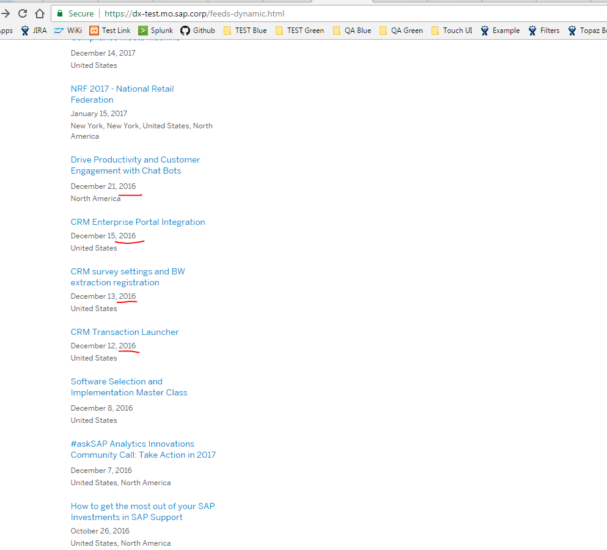

## Prerequisites  
 - **Proficiency:** Beginner
 - **Tutorials:** [Configuring Eclipse with SAP HANA Cloud Platform Tools for Java](https://github.com/mamosova/tutorials/edit/master/tutorials/test1111/accardion.md)

## Next Steps
 - Select a tutorial from the [Tutorial Navigator](http://go.sap.com/developer/tutorial-navigator.html) or the [Tutorial Catalog](http://go.sap.com/developer/tutorials.html)

## Details
### You will learn  
In this tutorial you will create a Dynamic Web project, a servlet to respond to a browser request and after running it in your local development environment, deploy it to SAP HANA Cloud Platform.

---

**Image with *jpg format**

   
   
   
   **Image with spaces between words (jpg format)**

    
   
   
   **Image with spaces between words (png format)**

   
   
   
   **Image with indicating the way. Example: tutorials/images/image.jpg (jpg format)**
   
   
   
   
   **Image with indicating the way. Example: tutorials/images/image.png (png format)**
   
   
   
   
   **Image with indicating the way and spaces between words. Example: tutorials/images/image test.jpg (jpg format)**
   
   
   
   
    **Image with indicating the way and spaces between words. Example: tutorials/images/image test.png (png format)**
    
   
   
   
   **Image from another folder. Example: with_Image/image.jpg (jpg format)**
   
   
   
   
   **Image from another folder. Example: with_Image/image.png (png format)**
   
   
   
   
   
      
    
   
    
   
   
   

